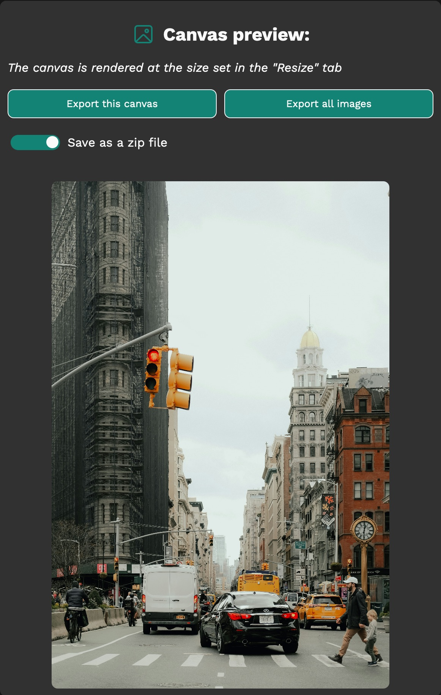

# image-converter

Convert images frmo various formats to JPG/PNG/WebP, by resizing them and adding
filters.

Try it: https://dinoosauro.github.io/image-converter/

Looking for the old, vanilla HTML/CSS/JS version? Check the
[old-js-website repository](https://github.com/Dinoosauro/image-converter/tree/old-javascript-website)

## How it works

### Choose a file

Open image-converter from the link above. You'll be prompted to choose some
files. You can choose everything from a folder, or you can manually pick the
files you want. You can also drop the images from the system's file picker.

### Change image

After that, a new page will be shown. At the top, all of the images you've
selected will be shown. Click on each photo to change the values of that one.

### Edit the width and height

Now you can choose to edit the width/height of the image: you can change them
with a percentage, or you can specify a fixed width or height (the other value
will be adapted by keeping the same aspect ratio)

### Apply filters

Then, you can apply filters to the image. Those filters are the same you can
apply to CSS items.

### Image preview

Finally, you can see a preview of your image, rendered with the same
width/height specified in the "Resize content" tab.

You can export only the current image, or all the images you've selected. Keep
in mind that, by default, image-converter will try using the File System API for
a native-like experience, but you can still use the normal file download by
disabling this feature in the settings.

## Settings

In the settings, you can:

- Edit the application theme (by changing also the colors used)
- Disable the File System API, that permits to write the images directly in a
  specific folder selected by the user (Currently available only on
  Chromium-based browsers)
- See the open source licenses

## Progressive Web App You can install image-converter as a Progressive Web App.
With this, you'll be able to use it offline, and you'll be also be able to open
files from the system's file explorer.

## Privacy

Your images are locally elaborated on your device, and nothing is sent to an
external server.
